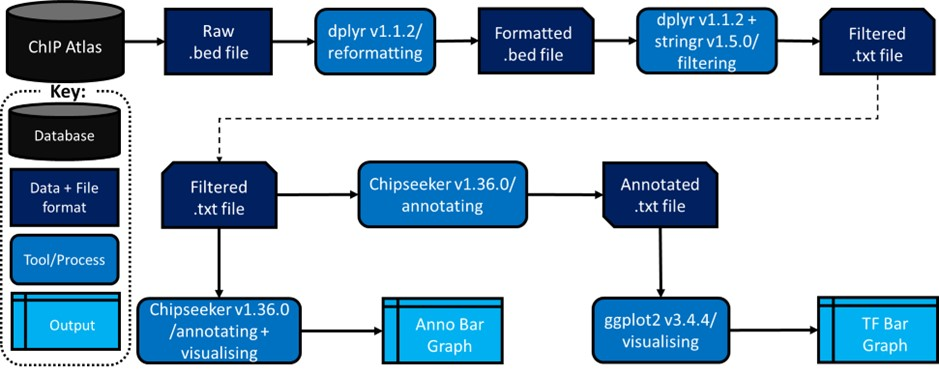

# ChIP-seq analysis pipeline:

## Data collection

This ChIP-seq analysis pipeline focuses on analyzing transcription factor (TF) peak binding data specific to cardiovascular cell lines. The primary data source is the ChIP-Atlas, from which a BED file containing TF peak binding data was downloaded using the [ChIP-Atlas Peak Browser](https://chip-atlas.org/peak_browser). The analysis uses the hg38 human reference genome to ensure compatibility and consistency throughout the pipeline.

## Steps to Download Data:
Visit the ChIP-Atlas Peak Browser.
Select the relevant criteria for cardiovascular cell lines and transcription factors.
Download the BED file containing the peak binding data.
Ensure the data aligns with the hg38 human reference genome.

## Scripts

### ChIP rerun p1.R
This script is the first part of the ChIP-seq analysis and is used for cleaning and filtering large bed files to genomic regions of interest:

**Tools and Packages:** Utilizes Bioconductor tools such as dplyr, stringr and tidyr.

**Inputs:**
BED file containing TF peak binding data.
hg38 human reference genome annotation files.

**Outputs:**
Annotated and filtered peak files.

**How to Use:**

Load the script "scripts/ChIP rerun p1.R" in R

Ensure the BED file is correctly specified within your working directory.

Execute the script in sequence: The script is annotated with instructions and troubleshooting methods.

### ChIP rerun p2.R
This script continues the ChIP-seq analysis and is used for annotating genomic regions and visualising TF binding patterns:

**Tools and Packages:** Utilizes additional Bioconductor packages such as ChIPseeker and ggplot2 as well as annotations from the TxDb.Hsapiens.UCSC.hg38.knownGene package.

**Inputs:**
Output from ChIP rerun p1.R.
TxDb.Hsapiens.UCSC.hg38.knownGene

**Outputs:**
Visualization files (e.g., bar plots, heatmaps).

**How to Use:**

Load the script: "scripts/ChIP rerun p2.R"

Ensure the outputs from ChIP rerun p1.R are correctly specified as inputs.

Execute the script in sequence: The script is annotated with instructions to annotate and transform inputs as well as generate visualizations.

### Visualisations
The purpose of the visualizations generated from the ChIP-seq analysis is to provide intuitive insights into the data and results.

Peak Distribution Plots: Show the distribution of TF binding peaks across different genomic features (e.g., promoters, exons, introns).

TF Bar Plots: Summarize the number of studies identifying TF binding peaks in the genomic regions of interest. Also highlights the different cell types where the peaks were observed.

## Useful Resources

- [ChIP Atlas Documentation](https://github.com/inutano/chip-atlas/wiki)
