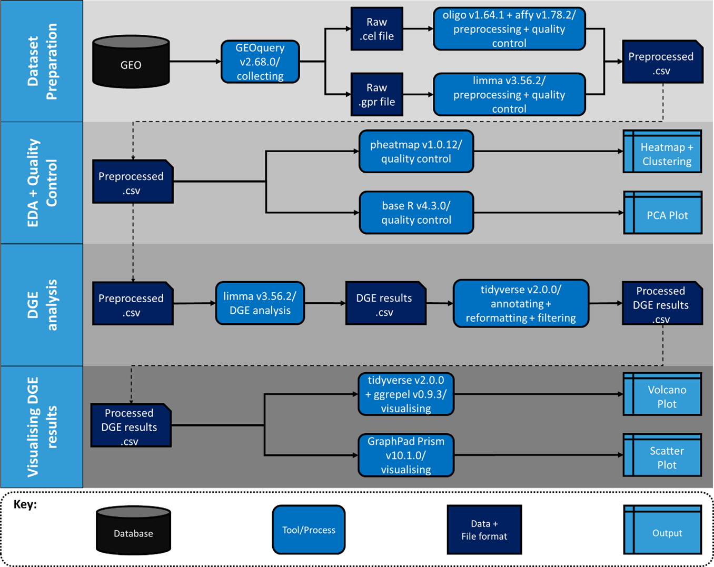

# Microarray Analysis Pipeline:

## Data collection
This microarray analysis pipeline focuses on processing and analyzing gene expression microarray data downloaded from the [Gene Expression Omnibus (GEO)](https://www.ncbi.nlm.nih.gov/geo/). The script is set up to analyse one GEO dataset at a time. When analysing a dataset, you will be downloading .tar files containing expression data in either .cel or .gpr file formats, along with supplementary materials containing important metadata. The GEOquery package in R is used to download these files directly from GEO.

**Steps to Download Data:**
Follow comments to install and load GEOquery

install.packages("GEOquery")
library(GEOquery)

Download expression data and supplementary data
Use the getGEOSuppFiles function to download the supplementary materials.

code for expression_data: getGEOSuppFiles("GSEXXXXX")
code for metadata: getGEO("GSEXXXXX")

**Input data:**
expression_data; contains fluorescence values for comparing gene expression levels, format depends on microarray platform
- Affymetrix Human Gene 1.0 ST Array: .cel files
- Affymetrix Human Genome U133A Array: .cel files
- Unigene3.1 cDNA Array: .gpr files

metadata; Contains important annotations for treatment conditions

**Output data:**
Annotated expressionSet object
DGE results tables

## Scripts
**Microarray MasterScript V1.R**
The Microarray MasterScript V1.R is the main script for processing and analyzing the microarray data. This script includes steps for data normalization, quality control, exploratory data analysis and differential gene expression analysis for all input data types.

**How to Use:**

The script is well-commented, providing step-by-step instructions.
Follow the comments to:
Load and preprocess the data.
Perform normalization using appropriate methods (e.g., RMA for .cel files).
Conduct quality control checks.
Carry out differential expression analysis using limma.

Execute each section sequentially as instructed by the comments to ensure proper workflow and data integrity.

**NOTE:** The script comments will specify the lines of code that should/should not be run depending on your input file.

## Visualisations
The visualizations generated from the microarray analysis are crucial for understanding the data quality and the biological significance of the results. Key visualizations include:

**Quality Control Plots:** These plots help assess the quality of the microarray data, identifying any outliers or technical issues.
**Boxplots:** Show the distribution of probe intensities across arrays before and after normalization.
**MA Plots:** Display the log ratios versus the mean average for each probe to assess the effect of normalization.
**Heatmaps:** Visualize the expression levels of top differentially expressed genes across samples.
**Volcano Plots:** Highlight significantly differentially expressed genes, showing both statistical significance and magnitude of change. Can also label genes of interest.

## Useful resources:
- [GEOquery documentation](https://bioconductor.org/packages/release/bioc/vignettes/GEOquery/inst/doc/GEOquery.html)
- [limma documentation](https://bioconductor.org/packages/release/bioc/vignettes/limma/inst/doc/usersguide.pdf)
- [affy and limma guide](https://bioconductor.org/packages/devel/workflows/vignettes/arrays/inst/doc/arrays.html)
