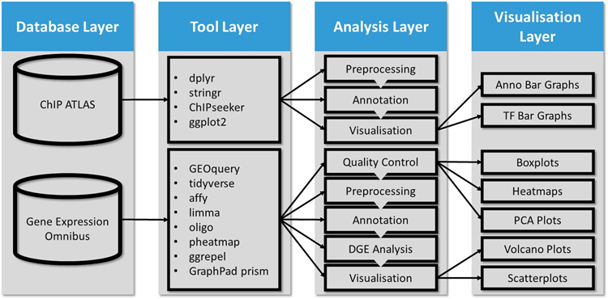

# ShivenNaidoo_MScProject
Repository is for a Masters Project in Applied Bioinformatics by Shiven Naidoo (registered with the University of the Witwatersrand, SID: 1943318).

This project aims to use R Bioconductor Tools and public -omics databases ([ChIP-Atlas](https://chip-atlas.org/) and [GEO](https://www.ncbi.nlm.nih.gov/geo/)) to identify potential regulatory Transcription Factors (TFs) for the genes _PXDN_ and _PXDNL_ in cardiovascular cell lines, as well as to explore their gene expression profiles in different cardiovascular disease (CVD) contexts.

## This project is divided into two pipelines:

**ChIP-seq pipeline:** Annotates and filters a ChIP-seq .bed file from ChIP-Atlas to identify TFs binding to the first introns and promoter regions of _PXDN_ and _PXDNL_ across different cardiovascular cell lines.

**Microarray pipeline:** Uses exploratory data analysis (EDA) and Quality Control (QC) tools to assess the integrity of gene expression microarray datasets. Differential gene expression analysis is then conducted on datasets of sufficient integrity to explore gene expression profiles of _PXDN_, _PXDNL_ and their associated TFs under various CVD-related conditions.
